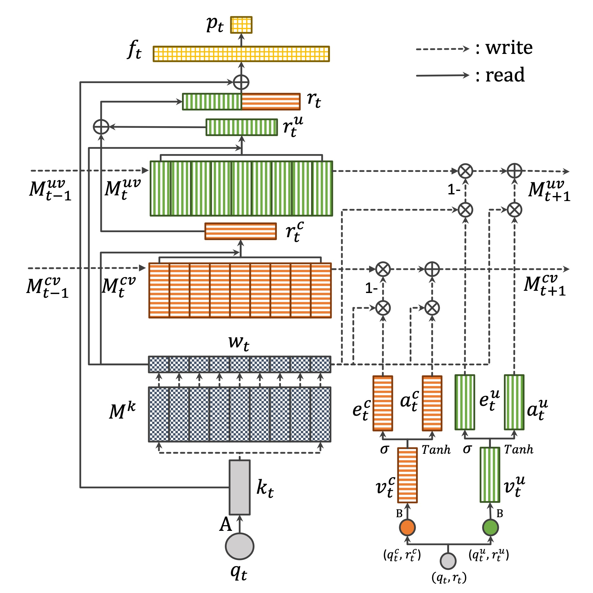

# DiKT : Dichotomous Knowledge Tracing


<!-- PROJECT SHIELDS -->
<!--
*** I'm using markdown "reference style" links for readability.
*** Reference links are enclosed in brackets [ ] instead of parentheses ( ).
*** See the bottom of this document for the declaration of the reference variables
*** for contributors-url, forks-url, etc. This is an optional, concise syntax you may use.
*** https://www.markdownguide.org/basic-syntax/#reference-style-links
-->

paper : [DiKT : Dichotomous Knowledge Tracing](https://link.springer.com/chapter/10.1007/978-3-030-80421-3_5)

conference : [ITS 2021 - 17th International Conference on Intelligent Tutoring Systems](https://its2021.iis-international.org/)


## Model Architecture
 


## Experiments

### Datasets
- ASSISTments2009
- ASSISTments2015
- Statics2011

### Models
- [DKT](https://proceedings.neurips.cc/paper/2015/file/bac9162b47c56fc8a4d2a519803d51b3-Paper.pdf)
- [DKVMN](https://dl.acm.org/doi/pdf/10.1145/3038912.3052580)
- [Deep-IRT](https://arxiv.org/pdf/1904.11738.pdf)
- Optional (Not in paper)
    - [SAKT](https://arxiv.org/pdf/1907.06837.pdf)
    - [SAINT](https://dl.acm.org/doi/pdf/10.1145/3386527.3405945)
    - [MxKT](https://github.com/14heeseok/DiKT_ITS21/blob/main/network/MxKT.py) : MLP-Mixer([MLP-Mixer](https://arxiv.org/pdf/2105.01601.pdf), [ResMLP](https://arxiv.org/pdf/2105.03404.pdf), [gMLP](https://arxiv.org/pdf/2105.08050.pdf)) based KT model

### Metrics

- [AUC](https://en.wikipedia.org/wiki/Receiver_operating_characteristic)
- [ACC](https://en.wikipedia.org/wiki/Accuracy_and_precision)

### Performance

<table class="tg">
<thead>
  <tr>
    <th class="tg-baqh" colspan="2">Models</th>
    <th class="tg-baqh" colspan="2">DKT</th>
    <th class="tg-baqh" colspan="2">DKVMN</th>
    <th class="tg-baqh" colspan="2">DeepIRT</th>
    <th class="tg-baqh" colspan="2">DiKT</th>
  </tr>
</thead>
<tbody>
  <tr>
    <td class="tg-baqh" colspan="2">Dataset \ Metrics</td>
    <td class="tg-baqh">ACC(%)</td>
    <td class="tg-baqh">AUC(%)</td>
    <td class="tg-baqh">ACC(%)</td>
    <td class="tg-baqh">AUC(%)</td>
    <td class="tg-baqh">ACC(%)</td>
    <td class="tg-baqh">AUC(%)</td>
    <td class="tg-baqh">ACC(%)</td>
    <td class="tg-baqh">AUC(%)</td>
  </tr>
  <tr>
    <td class="tg-baqh" colspan="2">ASSISTments2009</td>
    <td class="tg-baqh">81.55</td>
    <td class="tg-baqh">76.74</td>
    <td class="tg-baqh">76.37</td>
    <td class="tg-baqh">81.07</td>
    <td class="tg-baqh">75.76</td>
    <td class="tg-baqh">79.76</td>
    <td class="tg-baqh">76.56</td>
    <td class="tg-baqh">81.33</td>
  </tr>
  <tr>
    <td class="tg-baqh" colspan="2">ASSISTments2015</td>
    <td class="tg-baqh">74.79</td>
    <td class="tg-baqh">72.82</td>
    <td class="tg-baqh">74.91</td>
    <td class="tg-baqh">72.49</td>
    <td class="tg-baqh">74.88</td>
    <td class="tg-baqh">72.04</td>
    <td class="tg-baqh">75.16</td>
    <td class="tg-baqh">72.60</td>
  </tr>
  <tr>
    <td class="tg-baqh" colspan="2">Statics2011</td>
    <td class="tg-baqh">80.98</td>
    <td class="tg-baqh">82.68</td>
    <td class="tg-baqh">81.50</td>
    <td class="tg-baqh">81.00</td>
    <td class="tg-baqh">80.41</td>
    <td class="tg-baqh">80.77</td>
    <td class="tg-baqh">80.85</td>
    <td class="tg-baqh">83.20</td>
  </tr>
</tbody>
</table>


## Requirements
* [torch](https://pytorch.org/) == 1.8.1 + cu102
* [einops](http://einops.rocks/) == 0.3.2 (for mixer-based models)

## Usage
1. Clone the repo
```sh
git clone https://github.com/14heeseok/DiKT_ITS21.git
```


<!-- CONTACT -->
## Contact

Heeseok Jung: poco2889@korea.ac.kr

Seonghun Kim: ryankim0409@korea.ac.kr

Project Link: [https://github.com/14heeseok/DiKT_ITS21](https://github.com/14heeseok/DiKT_ITS21)


<!-- ACKNOWLEDGEMENTS -->
## References
* [seewoo5/KT](https://github.com/seewoo5/KT)


<!-- MARKDOWN LINKS & IMAGES -->
<!-- https://www.markdownguide.org/basic-syntax/#reference-style-links -->
[contributors-shield]: https://img.shields.io/github/contributors/othneildrew/Best-README-Template.svg?style=flat-square
[contributors-url]: https://github.com/othneildrew/Best-README-Template/graphs/contributors
[forks-shield]: https://img.shields.io/github/forks/othneildrew/Best-README-Template.svg?style=flat-square
[forks-url]: https://github.com/othneildrew/Best-README-Template/network/members
[stars-shield]: https://img.shields.io/github/stars/othneildrew/Best-README-Template.svg?style=flat-square
[stars-url]: https://github.com/othneildrew/Best-README-Template/stargazers
[issues-shield]: https://img.shields.io/github/issues/othneildrew/Best-README-Template.svg?style=flat-square
[issues-url]: https://github.com/othneildrew/Best-README-Template/issues
[license-shield]: https://img.shields.io/github/license/othneildrew/Best-README-Template.svg?style=flat-square
[license-url]: https://github.com/othneildrew/Best-README-Template/blob/master/LICENSE.txt
[linkedin-shield]: https://img.shields.io/badge/-LinkedIn-black.svg?style=flat-square&logo=linkedin&colorB=555
[linkedin-url]: https://linkedin.com/in/othneildrew
[product-screenshot]: images/screenshot.png
